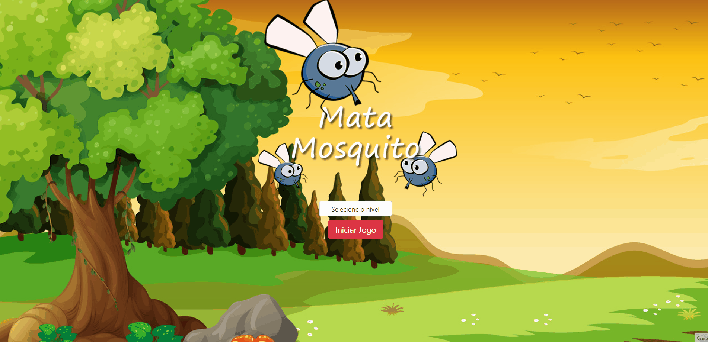

# AppMataMosquito

    Um game simples, onde você utiliza a capacidade de clicar com o mouse para matar mosquitos em três níveis de dificuldades diferentes.

 

    A idéia desse projeto foi utilizar todas as linmguagens que eu aprendi até o momento, o projeto foi oferecido pelo professor Jorge Sant Ana. Com esse projeto eu pude avançar mais um pouco e me sinto orgulhosa do que consegui. 

 

      Nada satisfaz mais um programador do que ver seu projeto finalizado por mais simples que seja!! 

    

 

##

## Linguagens Utilizadas

 
 
 
 

